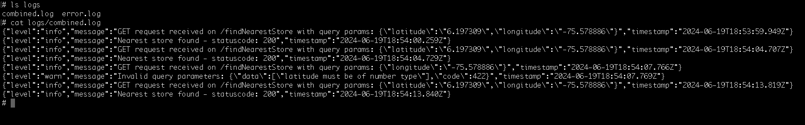
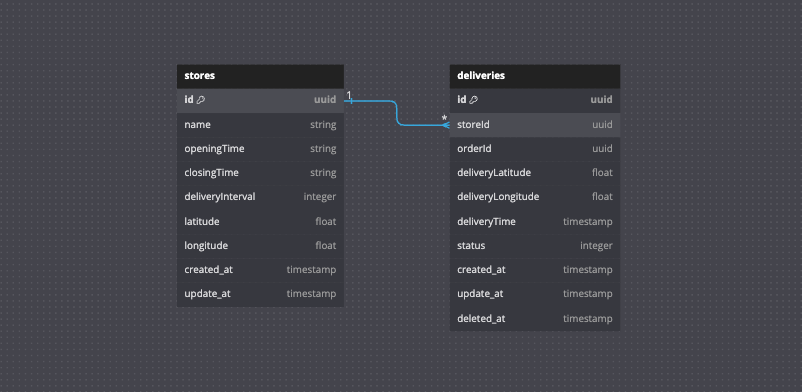

# InstaStore - API

## Description

InstaStore is a microservice tasked with selecting the nearest “convenience” store to deliver a grocery order to our B2B customers.

Once the request is received, it searches for the nearest store within a 10 km range, calculating the next available delivery time based on existing orders and the store's closing time. Then, provide the customer with the details of the store closest to their location and the estimated delivery time.

## Content

1. [Requirements](#requirements)
2. [Installation](#installation🛠️)
3. [How to Use](#how-to-use)
4. [Project Structure](#project-structure)
5. [Questions](#questions)
6. [Authors and Contact](#authors-and-contact✒️)
  

## Requirements
**Non-functional**

We expect you to deliver idiomatic code in a way that is easy to read and follows the accepted guidelines in your area of expertise.
You should write it on Node.js with Express.js. Libraries, transpilers, etc are up to you.
- Endpoints are fast (less than 300ms).
- Endpoints respond to error codes that make sense to the case.
- Please provide documentation for the endpoints you create

**Functional**

- Our B2B clients should be able to consume an endpoint that provides
them the following information:
	```plaintext
	storeId
	storeName
	isOpen
	coordinates
	nextDeliveryTime
	```
- The endpoint returns the closest store available
- We need to keep track of each call to the endpoint

## Installation🛠️ 

-   **Language:**  NodeJS v18.20.3
-   **Framework:**  Express, Sequelize.

Follow the instructions to install and run the project locally.

1.  **Clone the Repository:**
	```bash
	git  clone  https://github.com/danielcinome/instastore-api.git
	cd  instastore-api
	```
2.  **Environment Variables Configuration:**
		You need to create a `.env`   file based on the file:
	```plaintext
	.env.example
	```
4.  **Docker Installation and execution**

	If you want to make use of docker, run the following commands;

	Build container and starting the service:
	```bash
	docker-compose up -d --build
	```
	Stop the service:
	```bash
	docker-compose stop
	```

## How to Use

To make HTTP requests to localhost using the `req.http` file, you need to install the appropriate extension for your text editor. If you are using Visual Studio Code, install the `REST Client` extension. These tool enable you to perform HTTP requests directly from within your text editor.

#### Endpoint:
```plaintext
GET /findNearestStore
```
#### Description:

This endpoint allows you to find the nearest store to a given set of coordinates (latitude and longitude). The calculation is based on the Haversine formula to determine the distance between the provided coordinates and the available stores.

#### Request Parameters:

-   **latitude** (required): The latitude of the customer's location.
    -   Example: `6.197309`
-   **longitude** (required): The longitude of the customer's location.
    -   Example: `-75.578886`

#### Example Request:
Find nearest store by latitude and longitude
```plaintext
GET http://localhost:8080/findNearestStore?latitude=6.197309&longitude=-75.578886
```

#### Response:

The API will return a JSON object with details about the nearest store or an appropriate error message.

##### Success (200):

-   **Status Code**: 200 OK
-   **Description**: The nearest store to the provided coordinates was found successfully.
-   **Response Body**:
    
    
```javascript
{
	"storeId": "f0a13b17-0f9b-40a7-93e2-d9f5b3dfb137",
	"storeName": "Tienda Medellin 8",
	"isOpen": true,
	"coordinates": {
		"latitude": 6.23866,
		"longitude": -75.5842
	},
	"nextDeliveryTime": "2024-06-19T10:50:18.422Z"
}
```
    

##### Not Found (404):

-   **Status Code**: 404 Not Found
-   **Description**: No stores were found near the provided coordinates in range of 10km.
-   **Response Body**:
    
```javascript
{
  "message": "No se encontraron tiendas disponibles en tu dirección"
}
```

##### Error (422):

-   **Status Code**: 422 Unprocessable Entity
-   **Description**: The request parameters are invalid or missing.
-   **Response Body**:
    
```javascript
{
	"data": [
		"latitude must be of number type",
		"longitude must be of number type"
	],
	"code": 422
}
```

##### Error (500):

-   **Status Code**: 500 Internal Server Error
-   **Description**: An unexpected error occurred on the server.
-   **Response Body**:
```javascript
{
	"message": "Internal server error",
	"code": 500
}
```

You can view the log records from the `logs/` folder



#### Use:

1.  **Set the Base URL**: Ensure the base URL of the API is correctly set. For local development, it might be `http://localhost:8080`.
2.  **Send a GET Request**: Use an HTTP client like Postman, Insomnia, or cURL to send a GET request to the endpoint with the required parameters.
3.  **Handle the Response**: Check the status code and response body to handle the result appropriately in your application.

#### Additional Notes:

-   Make sure to replace `localhost:8080` with the actual base URL if the API is deployed on a server.
-   The coordinates (latitude and longitude) should be accurate to get the correct nearest store.


## Project Structure

The microservice follows a clean architecture, ensuring separation of concerns and promoting maintainability and scalability. Here’s an overview of the architecture:

 - **Entities:** Represent the core business objects and their properties.
 - **Repositories:** Handle the data access logic, interacting with the
   database.
 - **Use Cases:** Contain the business logic, orchestrating
   interactions between repositories and other services.
 - **Controllers:** Expose endpoints for the API, handling HTTP requests and responses.
 - **Utils:** Provide utility functions to support various operations.   
   Components.

```textplain
├── Docker/
│   ├── app/
│   │   ├── Dockerfile          # Docker configuration for the application
│   │   ├── package.json        # Dependencies and scripts
│   ├── database/
│   │   ├── Dockerfile          # Docker configuration for the database
│   │   ├── script.sql          # SQL script for initializing the database
├── src/
│   ├── framewoks/
│   │   ├── db/
│   │   │   └── squelize.js 	# Sequelize setup and configuration
│   │   ├── http/
│   │   │   └── express.js		# Express framework setup and configuration	
│   │   │   └── ajv.js			# AJV setup for JSON schema validation
│   ├── stores/
│   │   ├── entities/
│   │   │   └── stores.js       			# Store entity definition
│   │   ├── repositories/
│   │   │   └── stores-repository.js  		# Repository for data access
│   │   ├── routers/
│   │   │   └── stores-router.js   			# Expose endpoints for the API
│   │   ├── usecases/
│   │   │   └── manage-stores-usecase.js  	# Business logic for managing stores
│   ├── utils/
│   │   └── winston.js		# Logger setup using Winston
│   ├── req.http			# HTTP requests for testing
│   ├── index.js            # Main entry point for the application
├── docker-compose.yml      	 # Docker Compose configuration for services
├── .env                         # Environment variables
├── README.md                    # Project documentation
```

The database model for the microservice primarily consists of two main entities: **Stores** and **Deliveries**.



## Questions
  
1. **Convenience Store Information:** In terms of functional requirements, is there a specific data source from which I can obtain the convenience store information? If there is no specific source, I will assume that I will use test data to develop the solution. Also;
	- **Response**: There is no data source, you can define the one you consider best suitable for your solution.

	- ¿Could you please provide clarification on the meaning and the intended use of the parameter "**nextDeliveryTime**"?
		- **Response**: The "nextDeliveryTime" field can be seen as the next time period where said store can deliver an order to a customer.
	- ¿Is the "**isOpen**" parameter subject to any specific schedule?
		- **Response:** The usefulness of the "isOpen" field, as its name states, allows the customer to know if a store in question is open to the public. You can define if you want to have specific hours for your stores.

  
2.  **Parameters Sent by B2B Customers:** To properly define the data schema and processing logic, could you please indicate what parameters our B2B customers will send through the endpoint? This information will help me to ensure that the endpoint meets the expectations and needs of our customers. Additional;

	- ¿Is there any specification or requirement regarding the handling of the nearest store, either by zipcode or specific coordinates?
		- **Response:** You can define the parameterization for your endpoint as you consider best for customers.

  
3.  **Endpoint Call Tracking:**  Regarding the need to track each call to the endpoint, is there any specification on how this information should be stored or specific data to be recorded?
	- **Response:** There is no storage requirement for trace logs, you can define the ones you consider most appropriate, taking into account that they allow you to understand the flow of your solution and debug cases of possible failures or malfunctions.
  
4.  **Security**: Are there any specific security requirements you should consider when designing the endpoint, such as authentication, authorization or data encryption?
	- **Rsponse:** There is no definition of security for your solution, you can include what seems best to you. Keep in mind the definition of product scope and customer interaction with your solution.

## Authors and Contact

- Daniel Chinome
- Contact: danielchinomedev@gmail.com
- [LinkedIn](https://www.linkedin.com/in/danielchinome/)